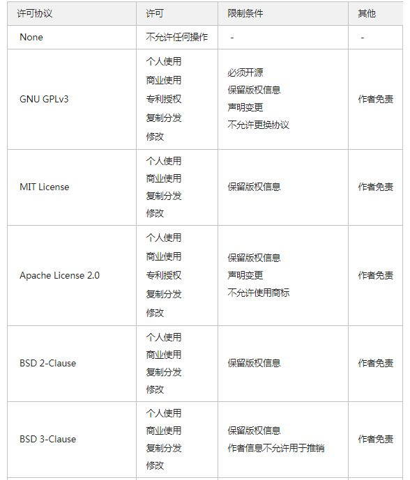
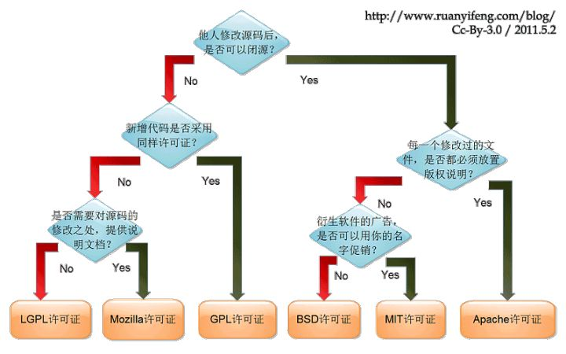

# GitHub开源协议详解及常用协议介绍
## 前言:

GitHub有许多开源的协议,刚开始使用时不知道选择哪些协议,今天我们就一起科普一下GitHub中的协议吧!

## 一、协议介绍

### 1. None / No License

如果你在使用GitHub中,没有选择协议默认是 [No License](https://choosealicense.com/no-permission/), 这并不是代码什么协议也没有, 它表示: **不允许他人进行复制、分发、使用和修改。但是如果你把它上传到了github，那么默认允许他人查看（view）源码、分叉（fork）到自己的仓库，只是不能使用、修改而已。**

### 2. Apache License 2.0

[Apache License 2.0](https://choosealicense.com/licenses/apache-2.0/) 协议来自于著名的Apache基金会，其最重要的开源软件就是Apache（HTTPD）网站服务器。 **它允许许任何人进行个人使用、商业使用、复制、分发、修改，作者免责，需要保留作者版权信息，声明更改的地方, 特点在于对于贡献者（Contributors）可以提供快速的专利授予。常用于大型开源项目**

### 3. MIT License

[MIT License](https://choosealicense.com/licenses/mit/) MIT是和BSD一样宽范的许可协议,作者只想保留版权,而无任何其他了限制.也就是说,你必须在你的发行版里包含原许可协议的声明,无论你是以二进制发布的还是以源代码发布的.总结一下只有三段话， **允许任何人进行个人使用、商业使用、复制、分发、修改，唯一的限制就是，必须得加上源码作者的版权信息（CopyRight）是一个相对宽松的常用的协议**

### 4. GNU GPLv3

[General Public License v3.0](https://choosealicense.com/licenses/gpl-3.0/) 开源正是由于GPL而变得越来越强大，GPLv3在2007年发布，它允许个人使用、商业使用、专利授权，允许复制、分发、修改，并且作者不承担用户使用的一切后果。但是它有很多限制：

1. 必须开源
1. **一旦使用了这个协议，如果他人想要进行分发、修改，那么他们修改后的源代码也必须开源。这是开源的核心保障，如果没有这条规定，就没有人愿意持续公开自己的源码了。**

2. 保留协议和版权
2. **保留对协议和版权的叙述。**

3. 不允许更换协议
3. **如果有人修改了一些源码，觉得自己改得还挺多的，想要换一个MIT或者什么协议，这是不允许的。一旦最原始的源码使用了GPL，其衍生的所有代码都必须使用GPL。这也是开源保障之一**

4. 声明变更
4. **对于代码的变更需要有文档进行说明改了哪些地方。**

### 5. BSD 2-Clause “Simplified” License

[BSD 2-Clause](https://choosealicense.com/licenses/bsd-2-clause/) **允许许任何人进行个人使用、商业使用、复制、分发、修改，除了加上作者的版权信息，还必须保留免责声明，免去作者的一些责任（比如使用后果）** 例如: 你在GitHub发布了一个AI换脸的项目, 别人clone后玩脱了跟你没关系.

### 6. BSD 3-Clause “New” or “Revised” License

[BSD 3-Clause](https://choosealicense.com/licenses/bsd-3-clause/) 在BSD 2-Clause上增加了一个条款

> 未经特别事先书面许可，著作权人的姓名和其贡献者的姓名不得用于认可或推销源自该软件的产品。  

在 BSD 2-Clause 的基础上, 不能使用作者的信息去做商业宣传, 应该是有人把开源软件拿去商用, 宣传说是xxx写的, 然后造成了不良影响…

### 7.Eclipse Public License 2.0

[Eclipse Public License 2.0](https://choosealicense.com/licenses/epl-2.0/) **是一种商业友好型协议，允许个人使用、商业使用、专利授权、复制、分发和修改，作者免责，需要保留版权信息、必须开源、不允许更换协议, 特点在于可以对软件进行商业使用，对专利授权免去版税**

### 8.GNU Affero General Public License v3.0

[GNU Affero General Public License v3.0](https://choosealicense.com/licenses/agpl-3.0/) **允许个人使用、商业使用、专利授权、复制、分发和修改，作者免责，贡献者可以快速专利授予，需要保留版权信息、必须开源、不允许更换协议、声明变更。和GPL类似，不同点在于，如果你修改了源码并在放到网上提供服务，那么你必须公开这个修改版本的完整的源代码。**

### 9.GNU General Public License v2.0

[GNU General Public License v2.0](https://choosealicense.com/licenses/gpl-2.0/) 相比于 GNU GPLv3，不能进行专利授予.

### 10.Mozilla Public License 2.0

[Mozilla Public License 2.0](https://choosealicense.com/licenses/mpl-2.0/) **是BSD系协议和GPL系协议的折中，允许个人使用、商业使用、专利授权、复制、分发和修改，作者免责，需要保留版权信息、必须开源，不允许更换协议（但允许更换成某些GNU协议），不允许使用商标。**

### 11.The Unlicense

[The Unlicense](https://choosealicense.com/licenses/un./imgs/) **是一个完全免费无约束的协议，也就是你放弃你的所有权利，将劳动成功无私奉献出来。允许任何人为了任何目的使用任何手段进行任何操作，不用保留任何信息，当然，作者免责**

## 二、特性总结

## 三、使用推荐

### 1、普通开发者

如果你是信仰开源大法的普通开发者，使用 MIT License 协议即可，它会保留你的版权信息，又允许他人进行修改。

### 2、用到了GNU的开发者

如果你用到了GNU的库，由于“传染性”，不允许更换协议，必须选择GNU相关的协议。

### 3、开源库开发者

推荐使用GNU LGPL相关协议。

### 4、无私奉献的雷锋

感谢你为世界作出的贡献，必选The Unlicense。

### 5、不知道该选什么

选择默认的None即可，保留你的全部权利，后续再去决定要不要更换协议。

## reference

[GitHub开源协议详解及常用协议介绍](https://blog.csdn.net/qq_42768234/article/details/104193778)
